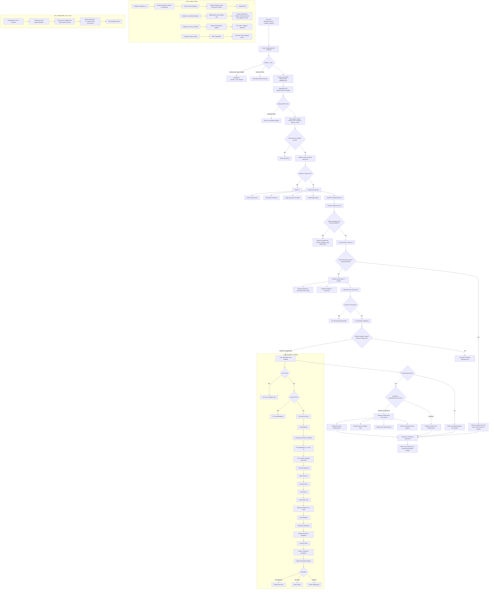
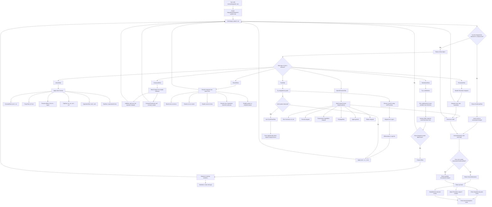

# Understanding
## Top-level Integration Module

The integral module is responsible for representing, manipulating, and evaluating integrals inside SymPy. It acts as a large decision-making system that tries to understand the type of integral being requested, prepares the expression properly, chooses suitable integration strategies, and then either returns a computed result or leaves the integral unevaluated if no method succeeds. The module supports indefinite integrals, definite integrals, multiple integrals, line integrals, changes of variables, differentiation under the integral sign, numerical approximation by sums, and Cauchy principal values. Because integration is one of the most complex areas in symbolic mathematics, the module is designed as a dispatcher that combines many algorithms rather than relying on a single method.

The process usually begins when the user calls the `integrate()` function. This function receives the mathematical expression to be integrated, the variable or variables of integration, and optional settings such as whether to use the Risch algorithm, Meijer G-functions, heuristic methods, or manual integration. The first major step is to create an `Integral` object. This object represents the integral symbolically before it is evaluated. The constructor of the `Integral` class checks whether the function being integrated has its own custom integration behavior through `_eval_Integral`. If it does, the module delegates the work to that custom method. If not, the standard `Integral` object is created using the general limit-handling structure inherited from `AddWithLimits`.

Once the `Integral` object exists, the real evaluation happens through the `doit()` method. This method is the core controller of the module. It begins by reading the options given by the user, such as `manual`, `meijerg`, `risch`, `heurisch`, and `conds`. These options affect which integration methods are allowed or preferred. The method also prevents contradictory instructions. For example, the user cannot force more than one exclusive method at the same time, such as asking for both `manual=True` and `risch=True`. The module also validates the `conds` option, which controls how convergence conditions are returned for improper integrals.

Before attempting difficult symbolic integration, the module checks for simple and special cases. If the integral is obviously zero, it immediately returns zero. This can happen if the integrand itself is zero or if a definite integral has identical upper and lower limits. The module also handles nested summations carefully, because integrating a sum may require checking whether the summation limits interfere with the integration variable. It also normalizes certain special functions, such as `Heaviside`, to make the behavior consistent. If the expression contains matrices, the integral is applied element by element. If the expression is a formal power series, the module uses the special integration logic for power series.

After preprocessing, the module begins handling the limits of integration. This is important because integrals can be indefinite, definite, or “evaluate-at” integrals. An indefinite integral usually has only a variable, such as integrating with respect to `x`. A definite integral has a variable plus lower and upper bounds. An evaluate-at integral has a variable and one bound-like expression. The module processes each limit in order, which is especially important for multiple integrals where one limit may depend on another variable. If a limit cannot be safely evaluated because it depends on another unresolved integration variable, the module temporarily stores that limit as undone and wraps the current expression back into an unevaluated `Integral`.

The module also performs important rewriting before integration. Expressions involving absolute value, sign functions, minimums, maximums, or piecewise definitions may need to be rewritten into `Piecewise` form. This is necessary because the antiderivative may depend on different cases over different intervals. For example, integrating an expression involving `Abs(x)` requires knowing whether `x` is positive or negative. By rewriting such expressions into piecewise form, the module can integrate each case more accurately.

The most important internal method for finding antiderivatives is `_eval_integral(f, x)`. This method tries several algorithms in a structured order. It starts with fast and simple cases. If the function is a polynomial, it integrates it directly. If the function does not actually depend on the variable of integration, the result is simply the function multiplied by the variable. If the expression can be converted into a polynomial in the integration variable, polynomial integration is used again because it is fast and reliable. Piecewise expressions are handled by special piecewise integration logic.

If the easy cases do not solve the integral, the module moves to more advanced symbolic methods. One major method is the Risch algorithm, which is designed to decide whether elementary functions have elementary antiderivatives. This is a mathematically powerful approach because it can sometimes prove that an elementary antiderivative does not exist. The module may also use rational integration through `ratint`, which is specialized for rational functions. For trigonometric expressions, it tries trigonometric integration rules. For expressions involving `DiracDelta` or singularity functions, it uses specialized algorithms designed for those objects.

If these methods fail, the module may try heuristic Risch integration. This is not a complete deterministic algorithm, but it can solve many practical integrals that other methods miss. The module can also use Meijer G-function methods. These methods rewrite expressions in terms of very general special functions called Meijer G-functions. This approach can be especially useful for definite integrals, particularly improper integrals involving infinity. However, Meijer G methods are not always the fastest or most natural-looking, so the module uses heuristics to decide when to try them.

The module also includes manual integration. This method attempts to imitate the steps a human might use when solving an integral by hand, such as substitution or integration by parts. It is not as broad as the full symbolic algorithms, but it can sometimes produce answers in a more familiar form. If manual integration produces a result that still contains unresolved integrals, the module may pass those remaining parts back to the other algorithms unless the user explicitly requested manual integration only.

A key feature of `_eval_integral` is that it often splits sums into separate terms. Since the integral of a sum can usually be written as the sum of the integrals, the module tries to integrate each term independently. This can make many problems easier. However, this is not always mathematically optimal, because sometimes a combined expression is integrable even when its separate parts are difficult. For this reason, the module delays this term-by-term splitting until after trying stronger methods like the Risch algorithm.

Once an antiderivative is found, the module decides how to use it. For an indefinite integral, the antiderivative becomes the result. For a definite integral, the module evaluates the antiderivative at the upper and lower limits and subtracts the results according to the Fundamental Theorem of Calculus. The module also handles special cases where the antiderivative contains unevaluated integrals, polynomials, or piecewise expressions. If the interval evaluation fails because the limits are too complicated, the module may keep the integral unevaluated instead of producing an unreliable result.

The module contains several additional capabilities beyond direct integration. The `transform()` method performs a change of variables. It can replace the integration variable or perform a u-substitution, but it must ensure that the mapping between old and new variables is unique. It also updates the integrand by multiplying by the derivative of the transformation, which plays the role of the Jacobian in one-dimensional substitution. It then updates the limits so the transformed integral has the same value as the original one.

Another important method is `_eval_derivative()`, which differentiates an integral with respect to a symbol. This uses differentiation under the integral sign and applies the Fundamental Theorem of Calculus when the limits depend on the differentiation variable. For example, if the upper limit of an integral depends on `x`, differentiating the integral produces a boundary term involving the integrand evaluated at that upper limit.

The module also provides `as_sum()`, which approximates a definite integral using Riemann-sum-style methods. It supports left, right, midpoint, and trapezoid rules. This is useful when the user wants a symbolic or numerical approximation rather than an exact antiderivative. Another method, `principal_value()`, computes the Cauchy principal value of certain improper integrals. It detects singularities inside the interval and evaluates limits around them in a symmetric or controlled way.

Finally, the module includes `line_integrate()`, which computes line integrals over curves. It substitutes the curve parameterization into the field, computes the arc-length factor from the derivatives of the curve components, builds an ordinary integral in the curve parameter, and then evaluates it. This shows that the module is not limited to basic single-variable calculus; it also supports more advanced calculus operations.

## Manual Integration Submodule

The `manualintegrate` module is designed to perform symbolic integration in a way that resembles how a student or mathematician would solve an integral by hand. Unlike the general `integrate()` function, which may use advanced algebraic algorithms, Risch integration, Meijer G-functions, or other powerful symbolic techniques, the manual integration module focuses on producing results through recognizable human-style steps. Its goal is not only to find an antiderivative, but also to represent the reasoning path used to reach that antiderivative. This makes the module especially useful for educational purposes, because it can explain the integration process as a sequence of rules such as power rule, substitution, integration by parts, trigonometric rewriting, partial fractions, or special-function recognition.

The central idea of the module is that every integration technique is represented as a rule. These rules are implemented as classes derived from a base `Rule` class. Each rule stores the integrand, the variable of integration, and any additional information needed to apply that method. Every rule has an `eval()` method, which actually produces the integrated result, and a `contains_dont_know()` method, which indicates whether the rule or any of its substeps failed to find a complete solution. This design separates the explanation of the integration process from the final answer. In other words, the module first builds a tree of integration steps, then evaluates that tree to obtain the antiderivative.

Simple integrals are handled by atomic rules. An atomic rule is a rule that does not depend on smaller substeps. For example, `ConstantRule` handles the integration of a constant with respect to a variable, returning the constant multiplied by that variable. `PowerRule` handles expressions like powers of the integration variable. `ReciprocalRule` handles the special case of integrating `1/x`, which produces a logarithm. Trigonometric rules such as `SinRule`, `CosRule`, `Sec2Rule`, and `Csc2Rule` handle common trigonometric antiderivatives. Hyperbolic functions are handled similarly by rules such as `SinhRule` and `CoshRule`. These rules represent the basic table of integrals that students usually memorize.

For more complicated expressions, the module uses compound rules that contain substeps. For example, `AddRule` represents the rule that the integral of a sum can be split into the sum of separate integrals. If the integrand is something like `x**2 + sin(x)`, the module can create an `AddRule` with one substep for integrating `x**2` and another substep for integrating `sin(x)`. Similarly, `ConstantTimesRule` represents the idea that a constant factor can be pulled outside the integral. If the expression is `5*sin(x)`, the module treats this as `5` times the integral of `sin(x)`. This mirrors exactly how a student would simplify an integral before solving it.

One of the most important mechanisms in the module is substitution, represented by `URule`. This rule handles integrals of the form `f(g(x))*g'(x)`, where a substitution such as `u = g(x)` makes the integral simpler. The module searches for possible inner functions that could be used as substitutions, checks their derivatives, and tests whether replacing them removes the original variable from the expression. If the substitution works, the module builds a new integral in terms of a dummy variable and then substitutes the original expression back into the result after evaluation. This allows the module to solve integrals such as expressions involving exponentials, trigonometric compositions, logarithms, and powers where a clear inner function exists.

The substitution search is handled by functions such as `find_substitutions`. This part of the module examines possible subexpressions inside the integrand and tests whether any of them can serve as a useful `u`. It considers common candidates such as arguments of trigonometric functions, exponential functions, logarithms, inverse trigonometric functions, hyperbolic functions, Heaviside functions, powers, products, and sums. The module then differentiates each candidate using `manual_diff`, which is a custom derivative helper designed to express derivatives in forms that are useful for manual substitution. For example, derivatives of functions like `tan`, `cot`, `sec`, and `csc` are written in forms that help the substitution matcher recognize patterns.

Another major technique in the module is integration by parts. This is represented by `PartsRule`, which follows the standard formula: the integral of `u dv` becomes `u v` minus the integral of `v du`. The module tries to choose `u` and `dv` using a LIATE-like priority system. This means it prefers logarithmic functions first, then inverse trigonometric functions, then algebraic functions, then trigonometric functions, and finally exponential functions. This priority system imitates the common classroom strategy for choosing which part of the integrand should be differentiated and which part should be integrated. For example, when integrating `x*exp(x)`, the algebraic part `x` is a good choice for `u`, while `exp(x)` is a good choice for `dv`.

The module also handles cyclic integration by parts through `CyclicPartsRule`. This is useful for integrals where applying integration by parts repeatedly eventually produces the original integral again. A classic example is integrating products such as `exp(x)*sin(x)` or `exp(x)*cos(x)`. In such cases, repeated integration by parts leads back to the starting integral, allowing the module to solve algebraically for the unknown integral. The `CyclicPartsRule` stores the repeated parts rules and a coefficient that describes how the original integral reappears. This is a sophisticated feature, but it still follows a human-style method.

Rewriting is another important part of the manual integration process. The module includes `RewriteRule`, which changes an expression into a form that is easier to integrate. For example, tangent may be rewritten as sine divided by cosine, cotangent as cosine divided by sine, secant in a form involving secant and tangent, or trigonometric and hyperbolic functions in terms of exponentials when that helps. There are also rewrite strategies for expanding expressions, applying partial fractions, canceling rational expressions, simplifying powers, and expanding trigonometric expressions. These rewrites do not directly integrate the expression; instead, they transform it into a better form and then call `integral_steps` again on the rewritten expression.

The module also contains specialized rules for particular expression families. Rational expressions may be handled through partial fraction decomposition or quadratic denominator rules. Expressions involving square roots of quadratics can be handled by inverse trigonometric or logarithmic forms. Some expressions are integrated through completing the square. The module also includes rules for special functions such as error functions, Fresnel integrals, exponential integrals, logarithmic integrals, polylogarithms, upper gamma functions, and elliptic integrals. Although these are more advanced than typical classroom integrals, the module still treats them as recognizable integration patterns with explicit rule classes.

A key function in the module is `integral_steps()`. This function does not immediately return the final antiderivative. Instead, it returns the first rule needed to solve the integral. That rule may contain substeps, and those substeps may contain further substeps, forming a nested tree of reasoning. For example, an integral may first be rewritten, then split into a sum, then each term may use a power rule or a constant multiple rule. This tree structure is what allows the module to provide step-by-step explanations. It is also why the module is useful in educational tools such as SymPy Gamma, where the goal is not just to give the answer but to show how the answer was obtained.

The `integral_steps()` function uses a strategy system to decide which rule should be applied. It looks at the type of the integrand and dispatches to suitable methods. If the integrand is a power, it may try the power rule, inverse trigonometric rules, quadratic denominator rules, or square-root rules. If the integrand is a sum, it applies the addition rule. If the integrand is a product, it may try constant multiple extraction, trigonometric product rules, Heaviside handling, substitution, partial fractions, cancellation, expansion, or integration by parts. If the integrand is a trigonometric function, it applies trigonometric rules or rewrites. If no rule succeeds, the module returns a `DontKnowRule`.

The `DontKnowRule` is important because it prevents the module from pretending to solve something it cannot solve. When no manual-style method is found, the module leaves the integral unevaluated. This is a good design choice because symbolic integration is difficult, and forcing an incorrect or artificial solution would be worse than admitting failure. The `contains_dont_know()` method allows larger rule trees to detect whether any part of the solution remains unresolved. For example, an `AddRule` may integrate three terms successfully but fail on the fourth; the system can identify that the full integration is incomplete.

The final user-facing function is `manualintegrate(f, var)`. This function calls `integral_steps(f, var)` to build the rule tree, then calls `.eval()` on that rule tree to compute the final antiderivative. After evaluation, it performs some cleanup. For example, it clears caches used during integration by parts, adjusts certain `Piecewise` outputs to put the more general case first, and factors terms in special cases involving error functions and trigonometric expressions. Unlike the general `integrate()` function, `manualintegrate()` only works for indefinite integration with a single variable. This limitation is intentional because the module is focused on human-style antiderivative techniques rather than the full range of symbolic integration.

The module also uses caching to avoid infinite loops. Some integration strategies, especially rewriting and integration by parts, can accidentally lead back to the same expression repeatedly. To prevent this, the module stores expressions it has already attempted using a dummy variable. If the same structure appears again during the same integration attempt, the module can stop that path and return `DontKnowRule` instead of looping forever. It also tracks how often a particular choice of `u` is used in integration by parts, which helps prevent endless repetition in cyclic or unsuitable cases.

# Refactoring

A substantial refactoring effort was undertaken on the SymPy integration subsystem with the goal of improving maintainability, readability, and extensibility of the codebase.

The primary  motivation behind this effort was that the integration engine had accumulated a significant amount of complex control flow over many years of development. The integration logic spans multiple algorithms, including heuristic methods, manual integration rules, Risch integration, and Meijer G-function based techniques. While highly capable, the implementation had become difficult to navigate and modify safely.

The refactoring focused on restructuring the integration workflow rather than introducing new mathematical capabilities.

Key changes included:

* Extracting and reorganizing large sections of integration logic into smaller, more focused components.
* Reducing deeply nested conditional structures inside the integration pipeline.
* Simplifying interactions between `Integral.doit()` and `_eval_integral()`.
* Improving separation of responsibilities between the high-level integration dispatcher and the individual integration strategies.
* Cleaning up duplicated logic surrounding evaluation hints (`manual`, `risch`, `heurisch`, and `meijerg` modes).
* Making the execution flow easier to follow by introducing clearer boundaries between preprocessing, algorithm selection, and result evaluation.
* Refactoring portions of the manual integration framework to improve consistency between rule generation and rule evaluation.
* Improving internal code readability through decomposition of large methods and simplification of control-flow paths.

Particular attention was given to the interaction between the integration engine implemented in `integrals.py` and the rule-based manual integration framework implemented in `manualintegrate.py`. These files represent some of the most complex and heavily interconnected parts of SymPy's symbolic integration system.

## Test Failures and Regression Analysis

Although the refactoring was designed to preserve behavior, the resulting implementation did not pass the full SymPy test suite.

Initial investigation suggested that the failures were not caused by obvious mathematical mistakes but rather by subtle changes in execution order and algorithm selection. SymPy's integration engine relies heavily on carefully tuned heuristics that determine:

* which integration strategy is attempted first,
* when fallback algorithms are invoked,
* how partially integrated expressions are processed,
* and when special-case handlers are activated.

Because of this, even seemingly harmless structural changes can alter the behavior of the system.

Several failing tests appeared to involve integration paths that eventually relied on Meijer G-function machinery. The Meijer G integration framework is particularly sensitive because it sits near the boundary between heuristic integration, special-function transformations, and definite integral evaluation. Small changes in dispatch order or intermediate expression structure can cause entirely different code paths to be taken.

In practice, the refactoring likely altered some of these delicate interactions. While the mathematical algorithms themselves were not intentionally modified, the surrounding control flow changed enough to affect behavior in a number of edge cases.

## Why the Work Was Abandoned

At this stage, continuing the effort would have required a detailed investigation of a large number of integration regressions, many of which involved highly specialized symbolic expressions and difficult-to-debug interactions between integration algorithms.

The expected maintenance cost outweighed the benefits of the architectural cleanup. More importantly, the refactoring did not provide any significant new user-facing functionality that would justify the risk of introducing subtle regressions into one of SymPy's most mature and sensitive subsystems.

As a result, the refactoring branch was abandoned before completion and is not intended to be merged into the main SymPy codebase.
